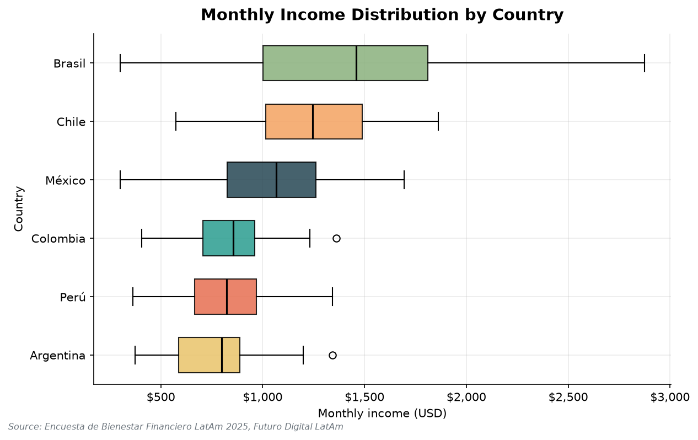
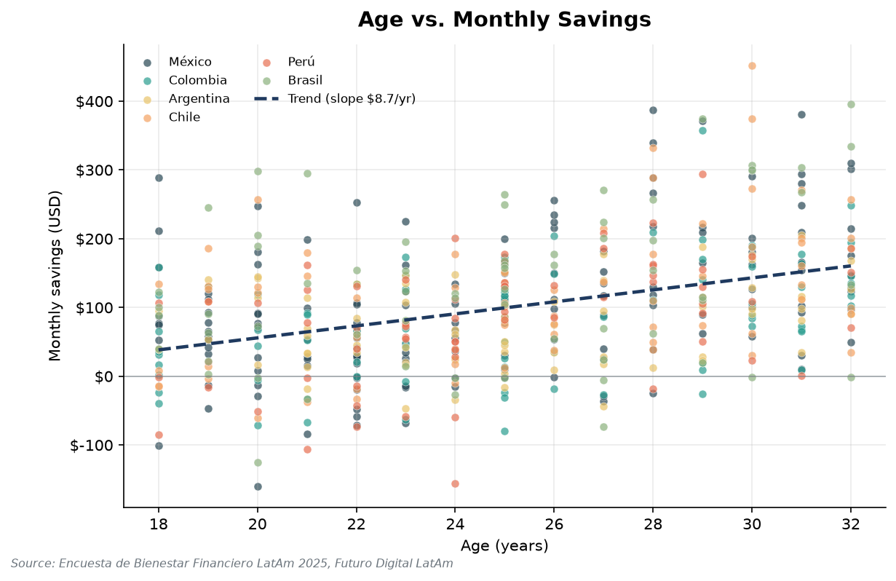
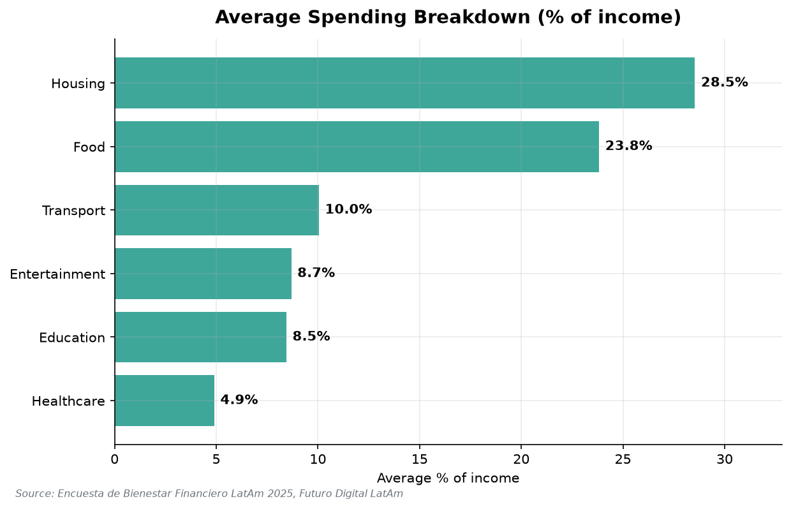
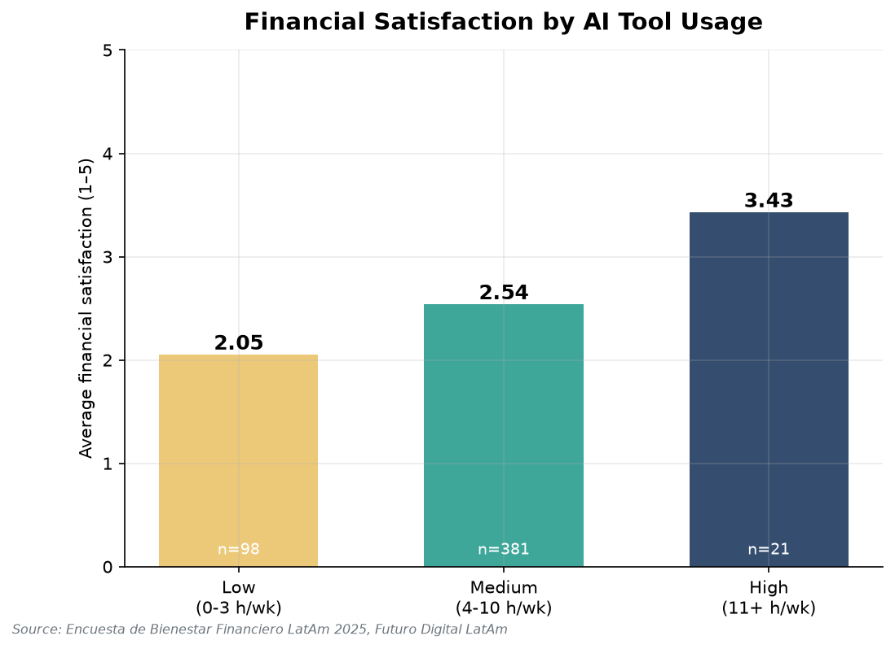
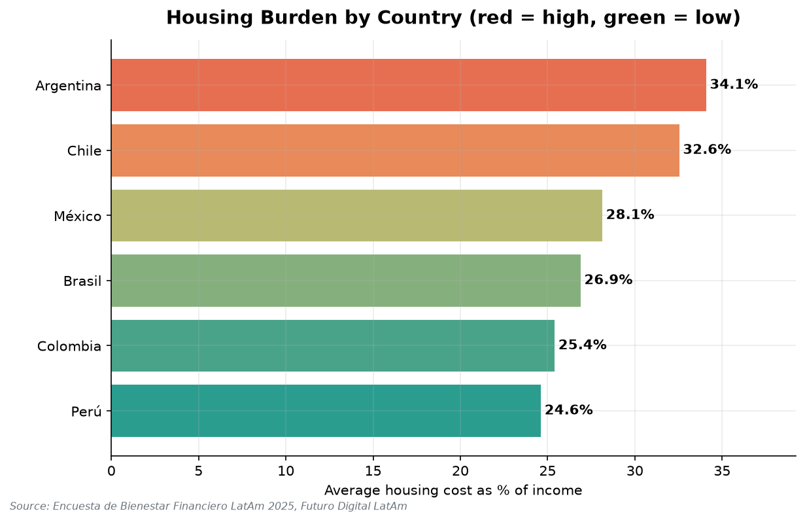

# Datos que Hablan: Bienestar Financiero de Jóvenes Profesionales en América Latina
## Informe Ejecutivo — Futuro Digital LatAm, 2025

*What the Data Says: Financial Wellness of Young Professionals in Latin America*

---

## 1. Resumen Ejecutivo (Executive Summary)

This report analyses the **Encuesta de Bienestar Financiero 2025**, a survey of **500 young
professionals** (ages 18–32) across six Latin American countries. Three findings stand out.
First, **income varies enormously by country**: Brasil's median monthly income ($1,458) is
**83% higher** than Argentina's ($798), so a one-size-fits-all programme will not work.
Second, **saving is a function of age**: respondents aged 18–22 save just **5.7%** of income,
rising to **15.5%** for those aged 29–32 (Pearson r = 0.41) — the youngest cohort is the most
financially fragile. Third, **housing and food alone consume 52% of income** on average, and in
Argentina housing alone reaches **34%**, leaving little room to save.

A striking correlation links **AI-tool usage to financial satisfaction** (r = 0.57), but this is
largely explained by income: heavy AI users earn far more, so AI literacy is best treated as a
complementary skill, not a cure.

**Two priority recommendations:** (1) Launch an **early-intervention savings track** aimed at the
under-25 segment, where the savings gap is widest; and (2) **Localise content by country**,
prioritising **housing-cost management** in high-burden markets (Argentina, Chile). Together these
target the groups and topics where the data shows the greatest need.

---

## 2. Metodología (Methodology)

- **Dataset:** Encuesta de Bienestar Financiero 2025 (`data/latam_finanzas_2025.csv`).
- **Sample:** 500 respondents, 6 countries (México, Colombia, Argentina, Chile, Perú, Brasil),
  ages 18–32, spanning 10 occupations and 10 industry sectors.
- **Variables:** 21 columns — income, seven expense/savings categories, credit & debt indicators,
  financial goal, weekly AI-tool hours, and a 1–5 financial-satisfaction score.
- **Processing approach:** A reproducible Python pipeline (pandas, matplotlib, seaborn, scipy) run
  in five numbered stages — `01_explore.py` → `02_clean.py` → country-profiler agent →
  `03_analyse.py` → `04_visualise.py`. All statistics derive from the cleaned dataset
  (`data/latam_finanzas_clean.csv`).

### Data Quality Log (from Phase 2)

| # | Problem found | Rows affected | Decision & rationale |
|---|---|---|---|
| 1 | **Inconsistent `industria` labels.** The technology sector appeared as four variants — `Tecnología` (47), `Tecnologia` (5), `tech` (3), `TECNOLOGÍA` (2). | 10 rows | Standardised all variants to **`Tecnología`** (now 57 rows). Case/spelling normalisation preserves every record and prevents the sector from being under-counted. Industry categories dropped from 13 to the correct 10. |
| 2 | **Missing values in `gasto_salud_usd`.** | 33 rows (6.6%) | **Filled with the median ($45.66).** The share missing is small and healthcare spending is right-skewed, so the median is robust to outliers and avoids dropping 33 otherwise-complete respondents. |
| 3 | **Negative `ahorro_mensual_usd`.** These are valid (respondents who spent more than they earned). | 74 rows (14.8%) | **Kept, not removed.** Added a boolean flag `ahorro_negativo` so the dissaving population can be studied rather than silently deleted. |

No rows were dropped: the clean file retains all **500 rows** and adds one column (`ahorro_negativo`).

---

## 3. Perfil de la Muestra (Sample Profile)

The 500 respondents are young professionals with a **mean age of 25.0** (median 25, range 18–32).
The sample skews slightly toward the youngest cohort: **162 respondents (32%) are aged 18–22**.

**By country:** México is the largest group (150, 30%), followed by Colombia (80), Argentina (70),
Chile (70), Brasil (65), and Perú (65).

**By industry:** the leading sectors are Finanzas (66), Tecnología (57, after cleaning),
Ingeniería (53), Ventas (51), Salud (49), and Marketing (49).

**By occupation:** the most common roles are Diseñador Gráfico (56), Ingeniero (55),
Community Manager (52), Gerente de Proyectos (51), Contador (50), and Analista Financiero (50).

**Financial profile:** median monthly income is **$960** (mean $1,017). **57%** hold a credit card,
**72%** have a savings account, and **47%** currently carry debt. The most common financial goal is
**"Pagar deudas" (pay off debt, 81 respondents)**, ahead of investing (75) and saving for
retirement (68). Average financial satisfaction is low at **2.48 / 5**, signalling widespread
financial stress across the sample.

---

## 4. Hallazgos por Análisis (Findings)

### 4.1 Income by Country

| Country | Median | Mean | Min | Max | Std. dev. |
|---|---|---|---|---|---|
| Brasil | $1,458 | $1,388 | $300 | $2,874 | $592 |
| Chile | $1,246 | $1,245 | $575 | $1,861 | $290 |
| México | $1,067 | $1,042 | $300 | $1,693 | $287 |
| Colombia | $857 | $849 | $405 | $1,363 | $189 |
| Perú | $822 | $818 | $362 | $1,342 | $208 |
| Argentina | $798 | $766 | $373 | $1,343 | $204 |

*Figure 1 — Monthly income distribution by country.*

**Interpretation.** Median incomes differ by **83%** between the highest (Brasil, $1,458) and lowest
(Argentina, $798) country, and Brasil also shows by far the widest spread (std. dev. $592, max
$2,874). This means financial capacity is highly uneven across the region, and a curriculum built
around Brazilian or Chilean income assumptions would be unrealistic for Argentine or Peruvian
participants. **Programme design implication:** set income-relative goals (e.g. "save 10% of *your*
income") rather than fixed-dollar targets, and prioritise the lower-income markets for
basic-budgeting content.

### 4.2 Age vs. Savings

| Age group | n | Avg. savings (USD) | Avg. savings rate |
|---|---|---|---|
| 18–22 | 162 | $60.80 | 5.72% |
| 23–25 | 123 | $76.48 | 8.32% |
| 26–28 | 87 | $120.98 | 11.72% |
| 29–32 | 128 | $154.07 | 15.52% |

**Correlation:** age vs. savings rate, Pearson **r = 0.41** (p < 0.001).

*Figure 2 — Age vs. monthly savings, with linear trend (slope ≈ $8.7/year) and country colour.*

**Interpretation.** The savings rate climbs steadily with age, nearly **tripling** from 5.7% among
18–22-year-olds to 15.5% among 29–32-year-olds, and the correlation is moderate and highly
significant. The sharpest weakness sits in the youngest cohort — the same group that is the largest
share of the sample. **Programme design implication:** the 18–25 segment would benefit most from
early intervention focused on building a savings habit before expenses (housing, family) compound —
exactly the moment where a small behavioural nudge compounds most over a career.

### 4.3 Spending Breakdown

| Category | Avg. % of income |
|---|---|
| Housing | 28.5% |
| Food | 23.8% |
| Transport | 10.0% |
| Entertainment | 8.7% |
| Education | 8.5% |
| Healthcare | 4.9% |

*Figure 3 — Average share of income spent per category (full sample).*

**Interpretation.** **Housing (28.5%) and food (23.8%) together absorb 52% of income**, and total
tracked expenses average **84.5%** — leaving a thin margin for saving or emergencies. The two
essentials that dominate the budget are also the two households have least discretion over in the
short run. **Programme design implication:** the highest-leverage content is not "cut back on
coffee" but structural — housing decisions (shared living, rent-to-income rules) and food budgeting,
since a 2–3 point reduction in either category roughly doubles the typical savings rate.

### 4.4 Credit Card Holders vs. Non-Holders

| Metric | Has card (n=284) | No card (n=216) | Difference |
|---|---|---|---|
| Avg. income | $1,023 | $1,008 | +1.5% |
| Avg. food spend | $258 | $222 | **+16.1%** |
| Avg. entertainment | $94.6 | $80.7 | **+17.2%** |
| Avg. savings | $101.8 | $95.4 | +6.7% |

**Interpretation.** Credit-card holders and non-holders earn **almost identical incomes (+1.5%)**,
yet cardholders spend **16% more on food and 17% more on entertainment**. Because income is flat, the
extra spending is not funded by higher earnings — it is consumption enabled by access to credit,
while the savings gap between the groups is comparatively small (+6.7%). **Programme design
implication:** pair any "access to credit" messaging with responsible-use content, targeting
discretionary categories (dining, entertainment) where card-enabled overspending concentrates.

### 4.5 AI Tool Usage vs. Financial Satisfaction

| AI usage group | n | Avg. satisfaction (1–5) | Avg. income |
|---|---|---|---|
| Low (0–3 h/wk) | 98 | 2.05 | $747 |
| Medium (4–10 h/wk) | 381 | 2.54 | $1,046 |
| High (11+ h/wk) | 21 | 3.43 | $1,750 |

**Correlation:** AI hours vs. satisfaction, Pearson **r = 0.57** (p < 0.001).

*Figure 4 — Average financial satisfaction by AI-tool usage group.*

**Interpretation.** Financial satisfaction rises strongly with AI-tool usage (r = 0.57, the strongest
relationship in the study). **However, this is likely confounded by income:** heavy AI users earn
**more than double** what low users earn ($1,750 vs. $747), and income itself drives satisfaction. AI
usage should therefore be read as a *marker* of higher-earning, more digitally-fluent professionals,
not a proven *cause* of financial wellbeing. **Programme design implication:** treat AI/digital
literacy as a complementary employability skill that may lift earning potential over time, but do not
promise that "using AI tools" directly improves finances — the honest story is about income and
skills, not a shortcut.

### 4.6 Housing Burden by Country

| Country | Avg. housing as % of income |
|---|---|
| Argentina | 34.1% |
| Chile | 32.6% |
| México | 28.1% |
| Brasil | 26.9% |
| Colombia | 25.4% |
| Perú | 24.6% |

*Figure 5 — Average housing cost as % of income, by country (red = high burden, green = low).*

**Interpretation.** Housing burden is highest in **Argentina (34.1%)** and **Chile (32.6%)** — both
above the widely-used 30% affordability threshold — and lowest in **Perú (24.6%)**. Notably,
Argentina combines the region's **lowest income** with its **highest housing burden**, a double
squeeze on the ability to save. **Programme design implication:** country-specific housing modules
should be front-loaded in Argentina and Chile, where reducing housing cost is the single most
effective lever available to free up savings capacity.

---

## 5. Recomendaciones (Recommendations)

1. **Launch an early-intervention savings track for the under-25 segment.** Finding 4.2 shows the
   18–22 group saves only 5.7% of income versus 15.5% for 29–32-year-olds. Target this cohort —
   the largest in the sample — with habit-formation content before financial obligations compound.

2. **Localise the curriculum by country instead of shipping one regional programme.** Finding 4.1
   shows an 83% income gap between Brasil and Argentina. Use income-relative goals and prioritise
   lower-income markets (Argentina, Perú, Colombia) for foundational budgeting.

3. **Make housing-cost management a flagship module in Argentina and Chile.** Finding 4.6 shows
   housing consumes 34% and 33% of income respectively — above the 30% affordability line. This is
   the highest-impact lever for freeing up savings in those markets.

4. **Add a responsible-credit component tied to discretionary spending.** Finding 4.4 shows
   cardholders spend 16–17% more on food and entertainment at equal income. Pair credit-access
   education with concrete discretionary-budgeting guardrails.

5. **Position AI/digital literacy as an earnings-and-employability skill, not a financial shortcut.**
   Finding 4.5 shows the AI–satisfaction link is confounded by income. Offer digital-skills content to
   raise earning potential, while keeping core financial messaging grounded in budgeting and saving.

---

## 6. Conclusión (Conclusion)

The data tells a clear, sobering story: young Latin American professionals are financially
stretched. Average satisfaction is just 2.48 out of 5, essentials consume 84% of income, and one in
seven respondents spends more than they earn. Yet the data also points to precise levers. Financial
resilience is strongly patterned by **age** and **country**, so the most effective programme is not
generic — it is **early, localised, and structural**: reaching the under-25s first, adapting to each
country's income and housing reality, and targeting the housing and food decisions that dominate
every budget. Done this way, financial-literacy education can move the region's young professionals
from merely surviving each month toward genuinely building wealth.

---

*Prepared by the Data Analyst team, Futuro Digital LatAm — 2025.
Source: Encuesta de Bienestar Financiero LatAm 2025.*
